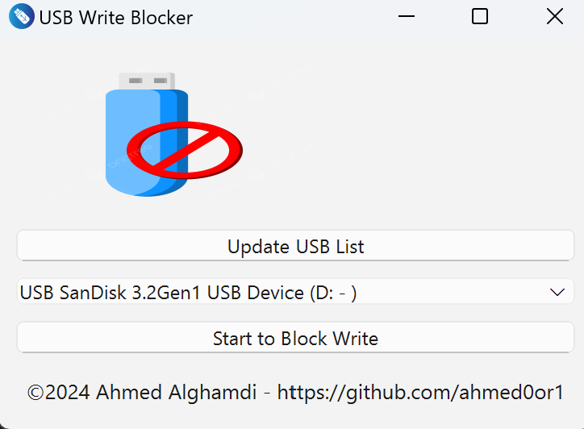

# WriteBlocker
  A Python script using PyQt6 to create a write-blocker tool, preventing unauthorized file modifications through command-line interface (CMD).

Screenshot_2024-11-05_160839.png

Screenshot_2024-11-05_160935.png

